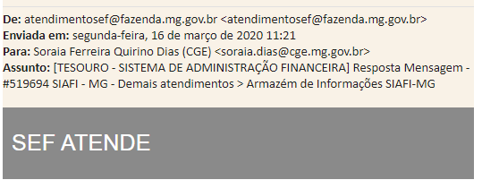

# Incorporação fale conosco centralizado

## Contextualização

O Portal de Transparência, atualmente, possui uma ferramenta própria utilizada para receber as demandas dos cidadãos via [fale conosco](http://transparencia.mg.gov.br/fale-conosco). Todas as solicitações recebidas nesse canal são direcionadas para um e-mail central (transparencia@cge.mg.gov.br), cuja a gestão é de responsabilidade da Diretoria Central de Transparência Passiva (DTP).

A equipe da DTP ao identificar alguma solicitação que deva ser respondida pela Diretoria Central de Transparência Ativa (DTA), encaminha essa demanda ao servidor responsável que possui até dois, a contar da data da solicitação, para efetuar a resposta e encaminhar novamente a DTP.

## Demanda

A SEPLAG possui um canal de fale conosco centralizado que é utilizado por grande parte dos órgãos e entidades, inclusive pela própria CGE ([fale conosco do sitio institucional](http://cge.mg.gov.br/cidadao/fale-conosco)).

Nesse sentido, com o objetivo seguir o padrão adotado pela SEPLAG, foi solicitado ao Frederico, responsável pela gestão do fale conosco da SEPLAG, quais os requisitos para que esse fale conosco fosse incorporado ao Portal da Transparência.

Conforme informado pelo Frederico/SEPLAG, seriam apenas necessários alguns dados para a efetivação dessa demanda, conforme e-mail enviado a DTA.

>Quando quiser entrar com o formulário no site da transparência, vou precisar apenas dos dados dos usuários que irão responder (NOME COMPLETO, CPF, E-MAIL e TELEFONE) e quais ASSUNTOS cada um irá responder.

No entanto, após conversa com o Frederico, identificamos que não seria possível manter o fluxo adotado pela DTP, pois não é possível vincular o e-mail ( transparencia@cge.mg.gov.br) sem também vincular um nome/CPF de um responsável.  

Para tentar resolver esse problema a sugestão da DTA foi vincular o e-mail ao nome/CPF da Superintendente ao e-mail. Contudo, obtivemos mais uma negativa, pois essa vinculação afetaria todos os sistemas corporativos que utilizam o SSC, conforme e-mail Frederico/SEPLAG:

> É possível cadastrar o e-mail em um CPF sim, mas estaríamos fazendo essa alteração em todos os sistemas corporativos que utilizam o SSC, como o SEI!.
A ferramenta também emite relatórios de prazo (% de demandas atendidas em 2 dias úteis), qualidade (% de demandas classificadas como "atendidas" pelo cidadão) e de acompanhamento (todos os dados das demandas, com possibilidade de exportar para Excel).

Considerando essa última informação encaminha à DTA acreditamos, que até o momento,  ser  inviável vincular o CPF/nome da Superintendente, pois isso afetaria todos os demais sistemas que ela possui acesso.

Assim será solicitado uma reunião com o Frederico/SEPLAG, para verificarmos se existem outras possibilidades para tentarmos manter fluxo já utilizado pela equipe DTP.

## Duvida??

O fale conosco utilizado pela SEF é gerenciado pela SEPLAG? Porque em uma solicitação realizada junto a esse órgão, a resposta enviada à CGE aparentemente foi enviada de um e-mail central

